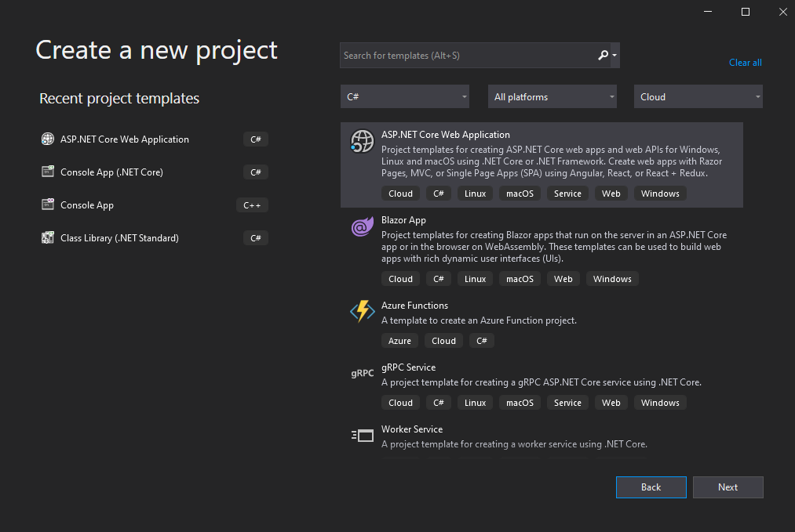
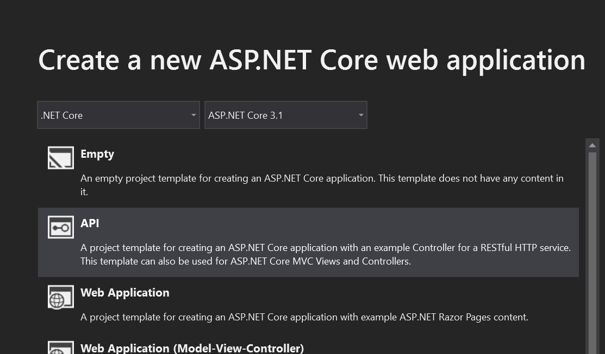
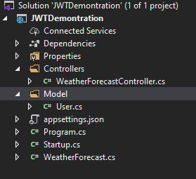
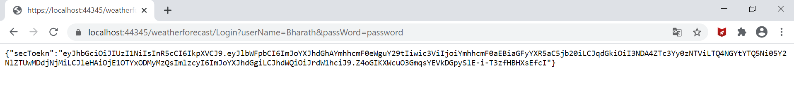
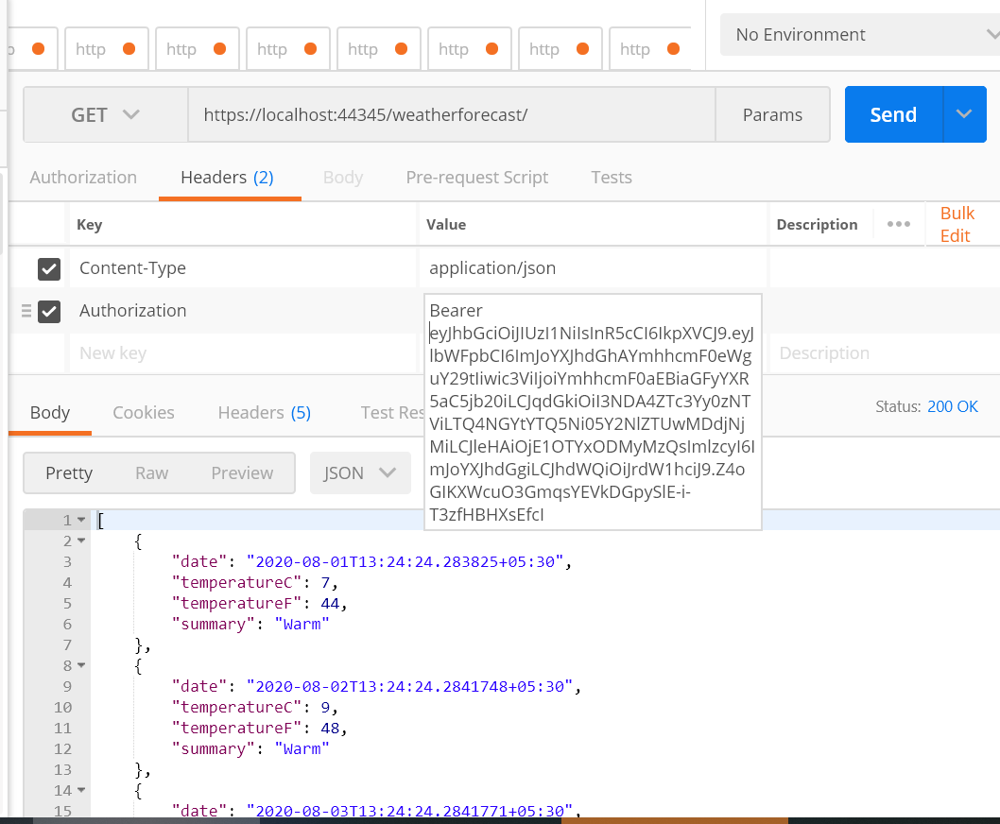

First, to understand about JWT, we should know what is stateless?

Consider there is a client and a Web API. Web API is protected, and you need a username and password to access the web API. The first thing that a designer thinks is to use a username and password. However, there will be multiple calls from the clients to the Web API. It is not an efficient design to provide usernames and passwords for every request. 
What are the other options to consider?
Consider you were going to a bank, and you raise a request to open a loan account. You have to visit the bank many times. Every time you visit the bank and each time you provide your details to bank staff to identify yourself is very annoying.
How about bank staff provides you a slip so that each time you visit the bank, you could recognize yourself by using the slip the bank provided to you.
That’s the basic principle of the token-based authentication.

What is JWT?

<will be updated>

Steps to create the sample demo application-

a.	Create an ASP .Net Core web application.
 
 

b.	Select API as below-

 

d.	In ..\JWTDemontration\JWTDemontration\Controllers\WeatherForecastController.cs file you will find below method-
[HttpGet]
        public IEnumerable<WeatherForecast> Get()
        {
            var rng = new Random();
            return Enumerable.Range(1, 5).Select(index => new WeatherForecast
            {
                Date = DateTime.Now.AddDays(index),
                TemperatureC = rng.Next(-20, 55),
                Summary = Summaries[rng.Next(Summaries.Length)]
            })
            .ToArray();
        }

This is the default Get method.
For the Login, create a new Get method and add a Route for the Login as below-

        [HttpGet]
        [Route("Login")]
        public IActionResult Get(string userName, string passWord)
        {
            return Ok();
     }

e.	Next, create a Model folder, and add a User.cs model 
 
namespace JWTDemontration.Model
{
    public class User
    {
        public string userName;

        public string passWord;
    }
}

 

f.	Let's start with adding a JWT code in the 

Add below code- 

if (userName != null && passWord != null)
            {
                if (userName != "Bharath" || passWord != "password")
                {
                    return RedirectToAction("Unauthorised");
                }

                var key = new SymmetricSecurityKey(Encoding.UTF8.GetBytes("This is my secret key!!!"));

                var cred = new SigningCredentials(key, SecurityAlgorithms.HmacSha256);

                var claims = new[]
                {
                new Claim(JwtRegisteredClaimNames.Email, "bharath@bharatyh.com"),
                new Claim(JwtRegisteredClaimNames.Sub, "bharath@bharatyh.com"),
                new Claim(JwtRegisteredClaimNames.Jti, Guid.NewGuid().ToString()),
            };

                var token = new JwtSecurityToken(
                    issuer: "bharath", // this should be in the config file
                    audience: "kumar",// this should be in the config file
                    claims,
                    expires: DateTime.Now.AddMinutes(20),
                    signingCredentials: cred
                    );

                var secToekn = new JwtSecurityTokenHandler().WriteToken(token);
                return Ok(new { secToekn });

            }

The explanation of the above code is here-

For the generation of the token, we need to use JwtSecurityToken() method (We need to install System.IdentityModel.Tokens.Jwt to access this method. Please refer https://docs.microsoft.com/en-us/previous-versions/visualstudio/dn464189(v=vs.114))for more information on this method.
We need to pass signingCredentials and claims as parameters to this method.

To create the signingCredentials, we need to use SigningCredentials() method. Please refer to https://docs.microsoft.com/en-us/dotnet/api/system.identitymodel.tokens.signingcredentials?view=netframework-4.8
To call SigningCredentials(), we need a key, and we will use SymmetricSecurityKey() to generate the key.
For JwtSecurityToken() other than signingCredentials, we also need to pass Claims.

We shall generate claims as below-
var claims = new[]
                {
                new Claim(JwtRegisteredClaimNames.Email, "bharath@bharatyh.com"),
                new Claim(JwtRegisteredClaimNames.Sub, "bharath@bharatyh.com"),
                new Claim(JwtRegisteredClaimNames.Jti, Guid.NewGuid().ToString()),
            };

g.	We have successfully created the JWT token. Let's launch the app and check the token by entering below URL in the browser-

https://localhost:44345/weatherforecast/Login?userName=Bharath&passWord=password

 

h.	However, the APIs are not yet protected. You need to add [Authorize] data annotation to the APIs you need to protect. And most importantly, you need to add JWT middleware code.
Let’s add [Authorize] to the default Get method so that the method will be accessed only if the token is passed in the header of the request-
     [HttpGet]
        [Authorize]
        public IEnumerable<WeatherForecast> Get()
        {
            var rng = new Random();
            return Enumerable.Range(1, 5).Select(index => new WeatherForecast
            {
                Date = DateTime.Now.AddDays(index),
                TemperatureC = rng.Next(-20, 55),
                Summary = Summaries[rng.Next(Summaries.Length)]
            })
            .ToArray();
        }

Now, add below middleware code in Startup.cs

    services.AddAuthentication(JwtBearerDefaults.AuthenticationScheme)
           .AddJwtBearer(options =>
           {
               options.TokenValidationParameters = new TokenValidationParameters
               {
                   ValidateIssuer = true,
                   ValidateAudience = true,
                   ValidateLifetime = true,
                   ValidateIssuerSigningKey = true,
                   ValidIssuer = "bharath",
                   ValidAudience = "kumar",
                   IssuerSigningKey = new SymmetricSecurityKey(Encoding.UTF8.GetBytes("BHarah12312312312131231232314"))

               };
           });

Let’s start testing-
Launch the application and enter below URL in the browser –
https://localhost:44345/weatherforecast/Login?userName=Bharath&passWord=password

 
  
 
You will get back the JSON token. Copy the token and launch Postman application.
Enter the URL - https://localhost:44345/weatherforecast/.
Now, in the header, enter the Authentication header as below- You will see the status is 200. You can try changing the token, which will return the Unauthorised error.

  
